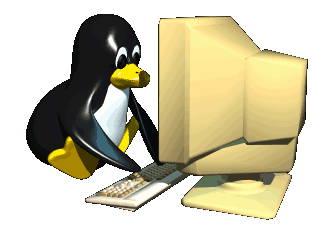

<!--Imagen de arriba-->

  

 

<!--Portada-->
<h1 align="center">  Hi , I'm Jhostin Andriy Guzman Rojas </h1>

  <h3 aling ="center">
    Sobre mi    
    Soy estudiante en Analisis y Desarrollo de software (SENA)
   
    
  
  </h3>
  

 

## 📞 Contacto
- **Email:** [jhostinguzman2006@gmail.com](mailto:jhostinguzman2006@gmail.com)
- **LinkedIn:** [linkedin.com/in/tuusuario](https://linkedin.com/in/tuusuario)

## 🏢 Experiencia Laboral
### **SENA** _(2025 - Actualidad)_
- Python.
- Java Script.
- Typescript

## 🎓 Educación
### **SENA** _(2025 - Actualidad)_
- Aprendiz de Analisis y Desarrollo de Software.
### **Bachiller** (Rafael Uribe Uribe 2023)
-Bachiller. 

-Tecnico en Recursos Humanos.
  
## 💡 Habilidades
- **Soy una persona motivado**
- **Me gusta usar mucho mi creatividad para un mejor aporte**
- **Siempre me gusta ver el futuro para tener una visión clara par desarrollar soluciones inclusivas y funcionales**
- **El trabajo en equipo es una de mis mayores fortalezas**
- **Siempre me gusta mantener la calma para encontrar alguna solucion frente al problema**

